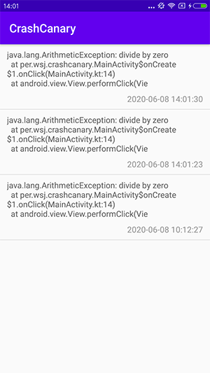
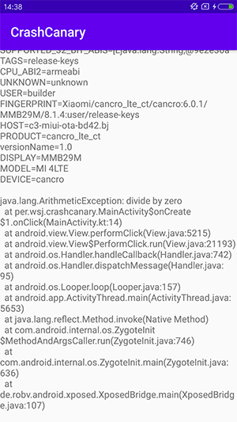

# CrashCanary


[](https://jitpack.io/#wdsqjq/CrashCanary)[](http://www.apache.org/licenses/LICENSE-2.0)

[English](./README_EN.md)

`CrashCanary`是一个无侵入的安卓崩溃日志记录库，对你的代码没有任务侵入性，无需申请权限，只需要添加依赖，即可在程序崩溃时记录崩溃日志并可查看所有日志。

## Preview


## Implementation

**Step 1.** Add the JitPack repository to your build file

```groovy
	allprojects {
		repositories {
			...
			maven { url 'https://jitpack.io' }
		}
	}
```

**Step 2.** Add the dependency

```groovy
debugImplementation  'com.github.wdsqjq:CrashCanary:1.0.4'
```

通过`debugImplementation`方式添加依赖只在debug模式生效，release模式不会生效。

## Usage

添加完对`CrashCanary`的依赖后无需添加任何代码，是的，你没看错，就是真么0浸入。

一旦你的应用发生异常崩溃，可以进入和你应用同名的图标为`CrashCanary`的入口，查看崩溃日志。





记录列表中可以长按item删除该日志。


## License

`CrashCanary` is released under the Apache License version 2.0.